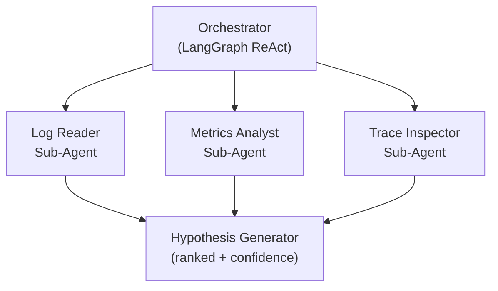

# Agentic RCA System — Eval & Observability Harness

An open-source reference implementation of an orchestrator/sub-agent system for automated root cause analysis (RCA), built with a production-grade eval and observability layer. This project demonstrates how to design, measure, and monitor an agentic AI system end-to-end — not just build one.

> **Why this project exists:** Most agentic AI demos show a working prototype. Few show how you'd know whether it's actually good, whether it's getting better or worse over time, or how you'd debug it in production. This project treats evaluation and observability as first-class design concerns, not afterthoughts.

---

## Table of Contents
- [Problem](#problem)
- [Architecture](#architecture)
- [Eval Framework](#eval-framework)
- [Observability](#observability)
- [Results](#results)
- [Design Decisions & Tradeoffs](#design-decisions--tradeoffs)
- [Getting Started](#getting-started)
- [Project Structure](#project-structure)
- [Roadmap](#roadmap)

---

## Problem

Incident response teams increasingly rely on AI agents to triage and diagnose issues faster than humans can manually correlate logs, metrics, and traces. But most agentic RCA demos stop at "it works on my example." This project asks and answers three harder questions:

1. **How do you decompose RCA into agent responsibilities that are testable in isolation?**
2. **How do you measure whether an agent's hypothesis is actually correct — not just plausible-sounding?**
3. **How do you observe what an agent did, at each step, when something goes wrong?**

---

## Architecture

An orchestrator coordinates single-purpose sub-agents in a ReAct loop, aggregating their outputs into a ranked, confidence-scored root-cause hypothesis.



**Sub-agents (single responsibility each):**
| Agent | Responsibility | Input | Output |
|---|---|---|---|
| Log Reader | Parses synthetic log anomalies, extracts relevant errors | Raw log lines | Structured `Observation` |
| Metrics Analyst | Detects metric spikes/threshold breaches | Synthetic metric series | Structured `Observation` |
| Trace Inspector | Walks distributed trace for latency/error propagation | Synthetic trace tree | Structured `Observation` |
| Hypothesis Generator | Combines observations into ranked root-cause hypotheses | All `Observation`s | `Hypothesis` with confidence score |

**State design:** All agents communicate through typed Pydantic models (`Observation`, `Hypothesis`, `TriageState`), not free-text — this keeps agent outputs machine-checkable, which is what makes the eval layer possible.

**Framework:** [LangGraph](https://github.com/langchain-ai/langgraph) for orchestration — chosen for explicit state graphs and native support for multi-agent routing.

---

## Eval Framework

A two-tier evaluation design, mirroring how you'd need to evaluate this in production:

**Tier 1 — Component-level:** Does each sub-agent do its one job correctly?
- e.g., did the Log Reader extract the actual root-cause error line, not a red herring?

**Tier 2 — End-to-end:** Is the orchestrator's final hypothesis correct and well-justified?
- e.g., does the ranked hypothesis match the labeled ground-truth root cause, with evidence that actually supports it?

**Metrics:**
| Metric | Tier | Tooling |
|---|---|---|
| Correctness (vs. labeled ground truth) | Both | Custom scorer |
| Groundedness (is the hypothesis supported by cited evidence?) | End-to-end | Custom LLM-judge |
| LLM-as-judge quality score | End-to-end | llama3.2 via Ollama |
| Prompt regression across models | End-to-end | Promptfoo |

**Eval set:** 25 synthetic, labeled incidents (log/metric/trace triples with a known ground-truth root cause) across 5 root cause types: connection pool exhaustion, memory leak, cache expiry, rate limiter misconfiguration, and cache eviction storm.

**LLM-as-judge:** Runs on llama3.2 locally via [Ollama](https://ollama.com) — chosen for its speed on a simple scoring task, keeping the eval layer fully reproducible at zero API cost.

**Model split:** llama3.1 (8B) runs the agents (complex multi-signal reasoning); llama3.2 (3B) runs the judge (simpler rubric scoring). This is a deliberate latency/quality tiering decision backed by Promptfoo eval data.

**CI:** GitHub Actions runs the eval suite on every commit; results are tracked over time so prompt/architecture changes can be compared against a baseline.

---

## Observability

Every orchestrator → sub-agent call is instrumented using [OpenTelemetry GenAI semantic conventions](https://opentelemetry.io/docs/specs/semconv/gen-ai/), capturing prompts, completions, token usage, and latency as spans.

Traces are viewed in **[Arize Phoenix](https://github.com/Arize-ai/phoenix)** (self-hosted, free), allowing you to inspect exactly which sub-agent contributed which evidence to a given hypothesis — and to correlate a trace with its eval score.

---

## Results

### End-to-End Eval (25 incidents, 5 root cause types)

| Metric | Score | Notes |
|---|---|---|
| Correctness | 0.94 | Keyword match vs labeled ground truth |
| Groundedness | 1.00 | All hypotheses cited real observation IDs — no hallucinated evidence |
| LLM-as-judge | 0.56 | llama3.2 scoring hypothesis quality on a rubric |
| Avg confidence | 0.97 | Agent self-reported confidence |
| Error rate | 0.00 | Pipeline ran without failures across all 25 incidents |

**Key finding:** The gap between correctness (0.94) and judge score (0.56) reflects hypothesis *quality* vs *accuracy* — the pipeline identifies the right root cause most of the time, but hypothesis phrasing is inconsistent. This gap motivated the prompt vocabulary improvement below.

**Overconfidence signal:** High agent confidence (0.97) paired with a middling judge score (0.56) suggests the agents are overconfident relative to actual output quality — a known failure mode in LLM systems worth monitoring in production.

---

### Promptfoo Prompt Iteration (llama3.1 vs llama3.2)

| Iteration | Change | Pass Rate |
|---|---|---|
| v1 | Original prompt, case-sensitive assertions | 66.67% |
| v2 | Added failure-mode vocabulary rules to prompt | 83.33% |
| v3 | Fixed case-insensitive assertions + vocabulary rules | 100% |

**What Promptfoo surfaced:** Inconsistent hypothesis terminology across models — "heap exhaustion" vs "memory leak", "cache miss" vs "cache expiry". Rather than relaxing eval assertions, the prompt was tightened to enforce consistent vocabulary. Downstream alerting systems depend on predictable output structure, making this a product decision, not just an engineering one.

*Trace screenshots and per-agent component scores to be added in Week 3.*

---

## Design Decisions & Tradeoffs

**Single-purpose sub-agents over one monolithic agent**
Each sub-agent has one job (read logs, analyse metrics, inspect traces) and emits a typed `Observation`. This makes each agent independently testable — Tier 1 evals can score each agent in isolation without running the full pipeline. A monolithic agent would conflate all three evidence sources, making it impossible to diagnose which part of the reasoning failed.

**Pydantic-typed state over free-text handoffs**
Agents pass structured `Observation` and `Hypothesis` models between each other, not natural language strings. This is what makes the eval layer possible — every field (evidence, confidence, observation ID) is machine-checkable programmatically. Free-text handoffs would require LLM parsing at every step, adding latency and failure modes.

**Two-tier eval design**
Component evals (Tier 1) catch sub-agent failures early — if the Log Reader misidentifies the signal, the end-to-end score will suffer but you won't know why without component scores. End-to-end evals (Tier 2) catch orchestration failures that only emerge when agents are combined. Running both is more expensive but gives actionable signal on where to improve.

**llama3.1 for agents, llama3.2 as judge**
Hypothesis generation requires complex multi-signal reasoning across logs, metrics, and traces — llama3.1 (8B) handles this better. Judging is a simpler rubric-scoring task where llama3.2 (3B) is sufficient and faster. This tiering was validated by Promptfoo eval data showing llama3.1 outperformed llama3.2 on vocabulary adherence and hypothesis quality.

**Defensive JSON parsing**
Smaller local models (llama3.2) occasionally truncate JSON responses, omitting the closing `}`. All agents patch this by appending `}` if missing before parsing. This is a real production concern when running open-weight models locally — noted here as a known limitation rather than silently swallowed.

**Promptfoo assertions use `.toLowerCase()` not `contains`**
Promptfoo's `contains` assertion is case-sensitive by default. LLMs capitalise terms inconsistently ("Connection pool" vs "connection pool"). Using JavaScript assertions with `.toLowerCase()` makes evals robust to capitalisation variance without weakening what's being tested.

---

## Getting Started

```bash
git clone https://github.com/<your-username>/agentic-rca-eval-harness.git
cd agentic-rca-eval-harness

# Create and activate virtual environment
python3 -m venv venv
source venv/bin/activate
pip install -r requirements.txt

# Install Ollama and pull models
brew install ollama
brew services start ollama
ollama pull llama3.1
ollama pull llama3.2

# Copy and configure environment variables
cp .env.example .env
# Edit .env and set LLM_PROVIDER, model names, and optionally ANTHROPIC_API_KEY

# Generate synthetic incident dataset
python generate_incidents.py --count 25 --output data/incidents.json

# Run the orchestrator on the first two incidents
python orchestrator.py

# Run the full eval suite
python evals/run_evals.py --incidents data/incidents.json

# Run Promptfoo prompt regression tests
cd evals && promptfoo eval -c promptfoo.yaml
```

*Full setup instructions in [`docs/SETUP.md`](docs/SETUP.md).*

---

## Project Structure

```
├── agents/                  # Sub-agent implementations
│   ├── log_reader.py        # Parses log lines → Observation
│   ├── metrics_analyst.py   # Analyses metrics → Observation
│   ├── trace_inspector.py   # Walks traces → Observation
│   └── hypothesis_generator.py  # Combines observations → Hypothesis
├── schemas/
│   └── state.py             # Pydantic models (Observation, Hypothesis, TriageState)
├── data/
│   └── incidents.json       # 25 synthetic labeled incidents
├── evals/
│   ├── run_evals.py         # Two-tier eval runner
│   ├── promptfoo.yaml       # Promptfoo prompt regression config
│   └── results/             # Eval output (gitignored, regenerated on each run)
├── observability/           # OTel instrumentation, Phoenix/Docker setup (Week 3)
├── docs/                    # Design doc, setup guide
├── orchestrator.py          # LangGraph orchestrator
├── generate_incidents.py    # Synthetic incident generator
└── .github/workflows/       # CI eval pipeline
```

---

## Roadmap

- [x] Week 1: Orchestrator + sub-agent architecture
- [x] Week 2: Eval layer (component + end-to-end) + Promptfoo prompt regression
- [ ] Week 3: Observability — OTel instrumentation + Arize Phoenix trace viewer

---

*Built as part of a portfolio project exploring production-grade agentic AI system design — architecture, evaluation, and observability treated as equally important disciplines.*
