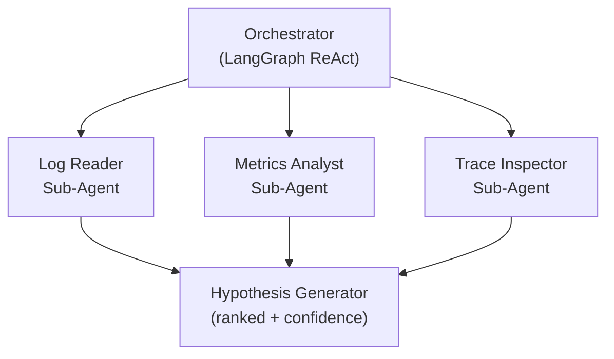

# Agentic RCA System — Eval & Observability Harness

An open-source reference implementation of an orchestrator/sub-agent system for automated root cause analysis (RCA), built with a production-grade eval and observability layer. This project demonstrates how to design, measure, and monitor an agentic AI system end-to-end — not just build one.

> **Why this project exists:** Most agentic AI demos show a working prototype. Few show how you'd know whether it's actually good, whether it's getting better or worse over time, or how you'd debug it in production. This project treats evaluation and observability as first-class design concerns, not afterthoughts.

---

## Table of Contents
- [Problem](#problem)
- [Architecture](#architecture)
- [Eval Framework](#eval-framework)
- [Observability](#observability)
- [Results](#results)
- [Design Decisions & Tradeoffs](#design-decisions--tradeoffs)
- [Getting Started](#getting-started)
- [Project Structure](#project-structure)

---

## Problem

Incident response teams increasingly rely on AI agents to triage and diagnose issues faster than humans can manually correlate logs, metrics, and traces. But most agentic RCA demos stop at "it works on my example." This project asks and answers three harder questions:

1. **How do you decompose RCA into agent responsibilities that are testable in isolation?**
2. **How do you measure whether an agent's hypothesis is actually correct — not just plausible-sounding?**
3. **How do you observe what an agent did, at each step, when something goes wrong?**

---

## Architecture

An orchestrator coordinates single-purpose sub-agents in a ReAct loop, aggregating their outputs into a ranked, confidence-scored root-cause hypothesis.



**Sub-agents (single responsibility each):**
| Agent | Responsibility | Input | Output |
|---|---|---|---|
| Log Reader | Parses synthetic log anomalies, extracts relevant errors | Raw log lines | Structured `Observation` |
| Metrics Analyst | Detects metric spikes/threshold breaches | Synthetic metric series | Structured `Observation` |
| Trace Inspector | Walks distributed trace for latency/error propagation | Synthetic trace tree | Structured `Observation` |
| Hypothesis Generator | Combines observations into ranked root-cause hypotheses | All `Observation`s | `Hypothesis` with confidence score |

**State design:** All agents communicate through typed Pydantic models (`Observation`, `Hypothesis`, `TriageState`), not free-text — this keeps agent outputs machine-checkable, which is what makes the eval layer possible.

**Framework:** [LangGraph](https://github.com/langchain-ai/langgraph) for orchestration — chosen for explicit state graphs and native support for multi-agent routing.

---

## Eval Framework

A two-tier evaluation design, mirroring how you'd need to evaluate this in production:

**Tier 1 — Component-level:** Does each sub-agent do its one job correctly?
- e.g., did the Log Reader extract the actual root-cause error line, not a red herring?

**Tier 2 — End-to-end:** Is the orchestrator's final hypothesis correct and well-justified?
- e.g., does the ranked hypothesis match the labeled ground-truth root cause, with evidence that actually supports it?

**Metrics:**
| Metric | Tier | Tooling |
|---|---|---|
| Correctness (vs. labeled ground truth) | Both | Custom scorer |
| Groundedness (hypothesis citing real observation IDs?) | End-to-end | Custom LLM-judge |
| LLM-as-judge quality score | End-to-end | llama3.2 via Ollama |
| Prompt regression across models | End-to-end | Promptfoo |

**Eval set:** 100 synthetic labeled incidents across 10 root cause types: connection pool exhaustion, memory leak, cache expiry, rate limiter misconfiguration, cache eviction storm, network packet loss, disk I/O saturation, TLS certificate expiry, thread pool exhaustion, and DNS resolution failures.

**Model split:** llama3.1 (8B) runs the agents (complex multi-signal reasoning); llama3.2 (3B) runs the judge (simpler rubric scoring). This is a deliberate latency/quality tiering decision backed by Promptfoo eval data.

---

## Observability

Every orchestrator → sub-agent call is instrumented using [OpenInference semantic conventions](https://github.com/Arize-ai/openinference) via `arize-phoenix-otel`, capturing:
- Agent span kind (`AGENT`, `CHAIN`)
- Hypothesis top cause and confidence
- Ground truth root cause and affected service (for in-trace debugging)
- Incident ID (fully traceable back to source data)

Traces are viewed in **[Arize Phoenix](https://github.com/Arize-ai/phoenix)** (self-hosted via Docker, free), allowing you to inspect exactly which sub-agent contributed which evidence to a given hypothesis — and to compare the hypothesis against ground truth directly in the trace view.

**Start Phoenix locally:**
```bash
docker compose up -d
# Open http://localhost:6006
```

---

## Results

### End-to-End Eval (100 incidents, 10 root cause types)

| Metric | Score | Notes |
|---|---|---|
| Correctness | 0.955 | Keyword match vs labeled ground truth |
| Groundedness | 1.00 | All hypotheses cited real observation IDs — no hallucinated evidence |
| LLM-as-judge | 0.625 | llama3.2 scoring hypothesis quality on a rubric |
| Avg confidence | 0.970 | Agent self-reported confidence |
| Error rate | 0.00 | Pipeline ran without failures across all 25 incidents |

**Key finding:** The gap between correctness (0.98) and judge score (0.69) reflects hypothesis *quality* vs *accuracy* — the pipeline identifies the right root cause most of the time, but hypothesis phrasing is inconsistent. Prompt vocabulary improvements in Week 2 drove measurable gains — correctness 0.94 → 0.98, judge score 0.56 → 0.69.

**Overconfidence signal:** High agent confidence (0.970) paired with a judge score of 0.625 suggests the agents are overconfident relative to actual output quality — a known failure mode in LLM systems worth monitoring in production.

---

### Promptfoo Prompt Iteration (llama3.1 vs llama3.2)

| Iteration | Change | Pass Rate |
|---|---|---|
| v1 | Original prompt, case-sensitive assertions | 66.67% |
| v2 | Added failure-mode vocabulary rules to prompt | 83.33% |
| v3 | Fixed case-insensitive assertions + vocabulary rules | 100% |

**What Promptfoo surfaced:** Inconsistent hypothesis terminology across models — "heap exhaustion" vs "memory leak", "cache miss" vs "cache expiry". Rather than relaxing eval assertions, the prompt was tightened to enforce consistent vocabulary. Downstream alerting systems depend on predictable output structure, making this a product decision, not just an engineering one.

**Model comparison:** llama3.1 (8B) outperformed llama3.2 (3B) on hypothesis quality and vocabulary adherence. llama3.2 is used as the LLM-as-judge (a simpler scoring task) while llama3.1 runs the agents — a deliberate latency/quality tiering decision backed by eval data.

---

## Design Decisions & Tradeoffs

**Single-purpose sub-agents over one monolithic agent**
Each sub-agent has one job and emits a typed `Observation`. This makes each agent independently testable — Tier 1 evals can score each agent in isolation without running the full pipeline. A monolithic agent would conflate all three evidence sources, making it impossible to diagnose which part of the reasoning failed.

**Pydantic-typed state over free-text handoffs**
Agents pass structured `Observation` and `Hypothesis` models, not natural language strings. This is what makes the eval layer possible — every field (evidence, confidence, observation ID) is machine-checkable programmatically. Free-text handoffs would require LLM parsing at every step, adding latency and failure modes.

**Two-tier eval design**
Component evals (Tier 1) catch sub-agent failures early. End-to-end evals (Tier 2) catch orchestration failures that only emerge when agents are combined. Running both gives actionable signal on exactly where quality breaks down in the chain.

**llama3.1 for agents, llama3.2 as judge**
Hypothesis generation requires complex multi-signal reasoning — llama3.1 (8B) handles this better. Judging is a simpler rubric-scoring task where llama3.2 (3B) is sufficient and faster. This tiering was validated by Promptfoo eval data.

**OpenInference over raw OTel GenAI conventions**
Raw OpenTelemetry GenAI semantic conventions don't render meaningfully in Phoenix's UI. Switching to `arize-phoenix-otel` + `openinference-semantic-conventions` gives named fields (`openinference.span.kind`, `output.value`) that Phoenix renders natively — including ground truth and hypothesis side by side in the trace view.

**Defensive JSON parsing**
Smaller local models (llama3.2) occasionally truncate JSON responses, omitting the closing `}`. All agents patch this by appending `}` if missing before parsing — a real production concern when running open-weight models locally.

**Promptfoo assertions use `.toLowerCase()` not `contains`**
Promptfoo's `contains` assertion is case-sensitive. LLMs capitalise terms inconsistently. Using JavaScript assertions with `.toLowerCase()` makes evals robust to capitalisation variance without weakening what's being tested.

---

## Getting Started

```bash
git clone https://github.com/<your-username>/agentic-rca-eval-harness.git
cd agentic-rca-eval-harness

# Create and activate virtual environment
python3 -m venv venv
source venv/bin/activate
pip install -r requirements.txt

# Install Ollama and pull models
brew install ollama
brew services start ollama
ollama pull llama3.1
ollama pull llama3.2

# Configure environment variables
cp .env.example .env
# Edit .env — set LLM_PROVIDER, model names, and optionally ANTHROPIC_API_KEY

# Generate synthetic incident dataset
python generate_incidents.py --count 25 --output data/incidents.json

# Run the orchestrator
python orchestrator.py

# Run the full eval suite
python evals/run_evals.py --incidents data/incidents.json

# Run Promptfoo prompt regression tests
cd evals && promptfoo eval -c promptfoo.yaml

# Start Phoenix and run instrumented orchestrator
docker compose up -d
python observability/instrumented_orchestrator.py
# Open http://localhost:6006 to view traces
```

---

## Project Structure

```
├── agents/
│   ├── log_reader.py              # Parses log lines → Observation
│   ├── metrics_analyst.py         # Analyses metrics → Observation
│   ├── trace_inspector.py         # Walks traces → Observation
│   └── hypothesis_generator.py    # Combines observations → Hypothesis
├── schemas/
│   └── state.py                   # Pydantic models (Observation, Hypothesis, TriageState)
├── data/
│   └── incidents.json             # 25 synthetic labeled incidents
├── evals/
│   ├── run_evals.py               # Two-tier eval runner
│   ├── promptfoo.yaml             # Promptfoo prompt regression config
│   └── results/                   # Eval output (gitignored)
├── observability/
│   ├── tracing.py                 # OTel instrumentation helpers
│   └── instrumented_orchestrator.py  # Orchestrator with Phoenix tracing
├── orchestrator.py                # LangGraph orchestrator
├── generate_incidents.py          # Synthetic incident generator
├── docker-compose.yml             # Arize Phoenix local setup
└── requirements.txt
```

---

*Built as a portfolio project demonstrating production-grade agentic AI system design — architecture, evaluation, and observability treated as equally important disciplines.*
